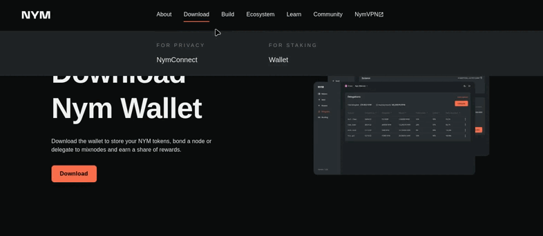
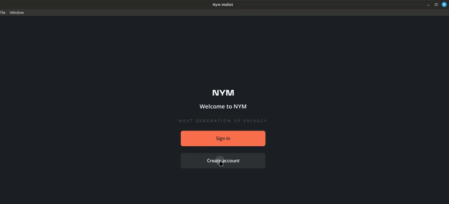
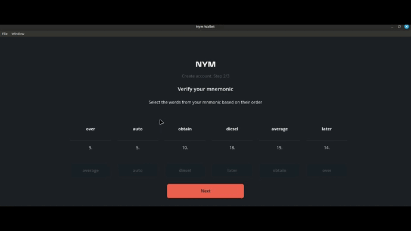

# 1.1 Wallet

### Crearemos la wallet de Nym en los siguientes pasos:

1. Descargamos la wallet de nym: [https://nymtech.net/download/wallet](https://nymtech.net/download/wallet) .

<figure><figcaption></figcaption></figure>

2. Abrimos la wallet de nym y anotamos las 24 palabras. Hacemos clic en "Continue".

<figure><figcaption></figcaption></figure>

4. Colocamos las palabras que nos pide y luego escribimos una contraseña para poder acceder a la wallet (recuerda que solo puedes crear una sola cuenta, pero puedes crear subcuentas).

<figure><figcaption></figcaption></figure>

5. Y tenemos creado la wallet.

<figure><figcaption></figcaption></figure>
