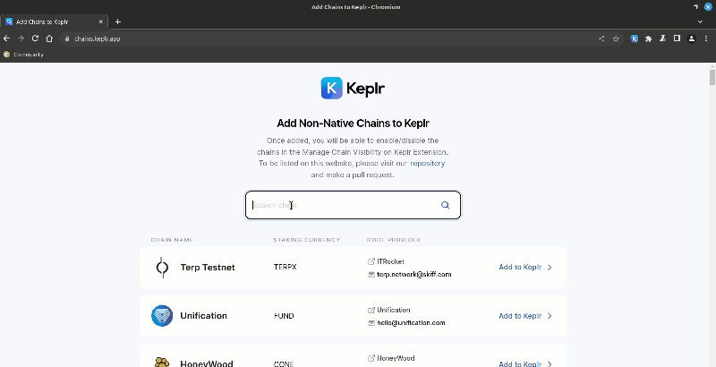
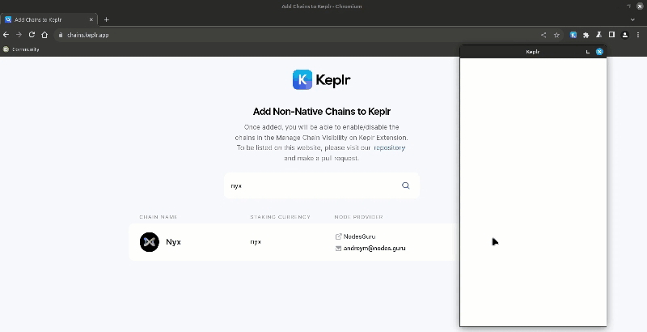
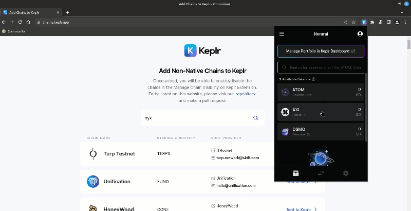
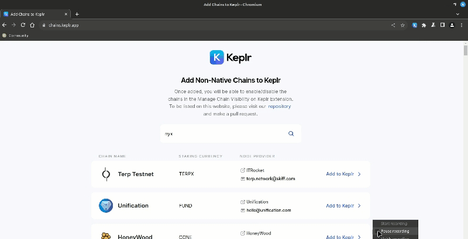
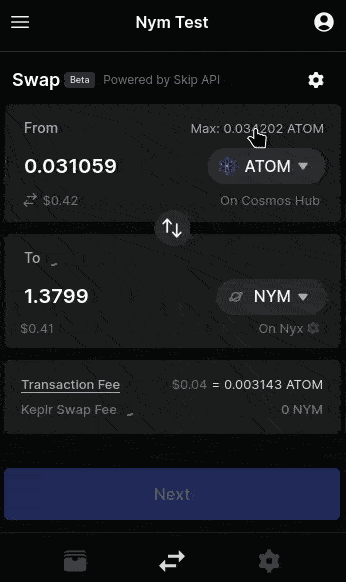
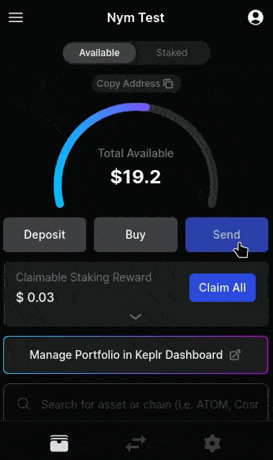

# 1.2 Keplr

Keplr Wallet es una billetera digital enfocada en el ecosistema de Cosmos, gracias a su excepcional interoperabilidad entre las diversas redes de Cosmos y su considerado número de usuarios activos. Esta billetera se ha consolidado como la elección preferida para la delegación y contribución de tokens, permitiendo a los usuarios participar activamente en las redes IBC de Cosmos.

1. Hacia la wallet de Keplr ([buscar IBC Nyx](https://chains.keplr.app/)) and dar a "Add to Keplr"

<figure><figcaption></figcaption></figure>

2. Ir a "Approve" para aprobar la conexión a tu wallet.

<figure><figcaption></figcaption></figure>

3. Buscar nyx y donde vas a "manage", te va abrir una ventada donde debes indicar Nyx y dar en el botón "Save" para guardar los cambios.

<figure><figcaption></figcaption></figure>

4. Revisa tu wallet esta habilitada la IBC Nyx

<figure><figcaption></figcaption></figure>

5. Elegimos los pares entre Cosmos/Nym para comprar. El swap permitirá la conexión entre la DEX de Osmosis como intercambio, donde se realizará el contrato inteligente de cambio para obtener tus Nym.  Introduces la cantidad a bajo de "From" para luego dar clic en el botón "Next".

<figure><figcaption></figcaption></figure>

6. Revisas el fee para luego dar clic en el botón "Approve".

<figure><figcaption></figcaption></figure>

7. Espera que haga el intercambio.

<figure><figcaption></figcaption></figure>

8. Listo, ya esta confirmado el intercambio y puede revisar tus Nym.

<figure><figcaption></figcaption></figure>

9. Puede revisar el siguiente tutorial:

<figure><figcaption></figcaption></figure>

10. Puedes enviar tu billetera de Nym después.

<figure><figcaption></figcaption></figure>

