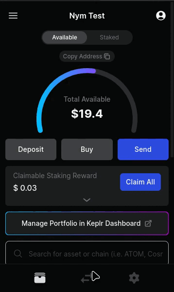
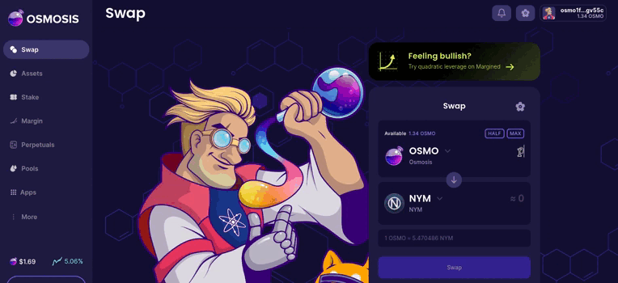
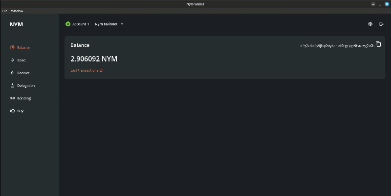
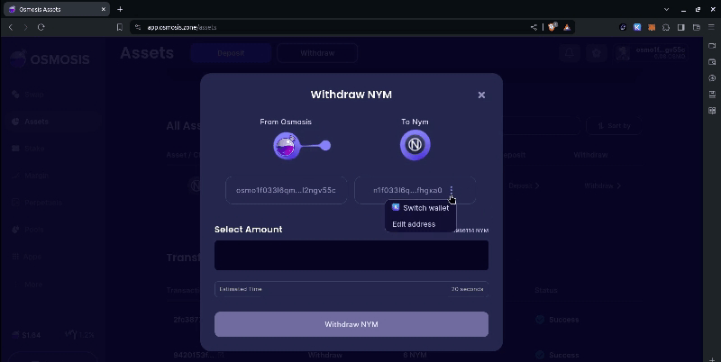
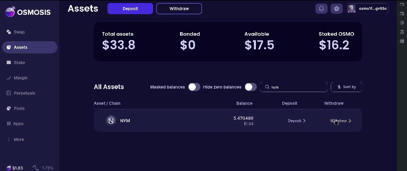
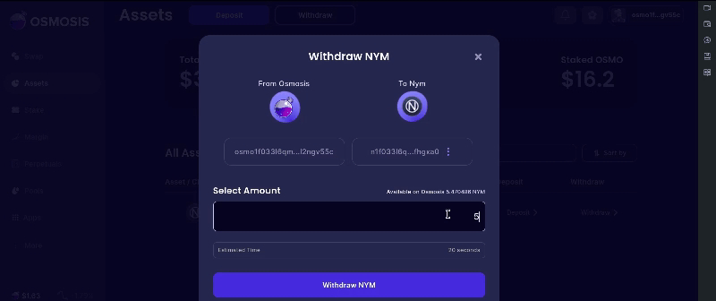
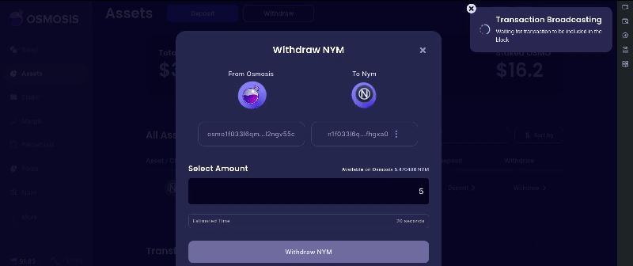

# 1.3 Osmosis

Osmosis destaca como el principal DEX en Cosmos, brindando liquidez a más de 50 blockchains a través de IBC. Su enfoque innovador se refleja en la integración de activos de diversos ecosistemas como Bitcoin y Ethereum. Inicialmente modelado tras Balancer, Osmosis evolucionó hacia un eficiente modelo de liquidez. Como appchain soberana, ejerce control total sobre su blockchain, posibilitando características distintivas como Superfluid Staking. Su gobernanza participa en actualizaciones, como la introducción de la Taker Fee. Osmosis busca trasladar la experiencia de intercambio centralizado al ámbito descentralizado, erigiendo un DEX intercadena que abarca diversas aplicaciones DeFi.

### Pasos para la compra de los Tokens de Nym en Osmosis

1. Compramos Tokens OSMOS por Keplr (extensión web) para poder intercambiar en[ Osmosis](https://app.osmosis.zone/?from=OSMO\&to=NYM) (OSMO es el token de la IBC de la blockchain de Osmosis)

<figure><figcaption></figcaption></figure>

2. Conectamos A [Osmosis](https://app.osmosis.zone/?from=OSMO\&to=NYM) a nuestra wallet, recomendable por la wallet de [Keplr](https://www.keplr.app/) .

<figure><figcaption></figcaption></figure>

3. Nos dirigimos a la parte donde dice [Swap](https://app.osmosis.zone/?to=NYM\&from=OSMO) y damos clic en el botón para hacer el swap. (Recuerda elegir bien los pares que son OSMO/NYM ). Después vas al botón "Approve".

<figure><figcaption></figcaption></figure>

4. Hacemos el envio desde la IBC Osmosis a Nyx, podemos usar dos formas:

#### Envió hacia la  Nym Wallet.

1. Copias la dirección.

<figure><figcaption></figcaption></figure>

2. Buscas el nombre de NYM y dar clic a "Withdraw".

<figure><figcaption></figcaption></figure>

3. Borrar y pegar la dirección que copiaste desde la Nym Wallet.

<figure><figcaption></figcaption></figure>

4. Introduces la cantidad en "Select Amout" y luego presionas el botón de "Withdraw NYM". Donde se enviara hacia tu Nym wallet y después procedes a revisar.

<figure><figcaption></figcaption></figure>

5. Aceptamos en "Approve" y luego enviamosa tu wallet nym.

<figure><figcaption></figcaption></figure>

6. Revisamos la wallet

<figure><figcaption></figcaption></figure>

* Hacia la wallet de Keplr ([buscar IBC Nyx](https://chains.keplr.app/))

1. Buscas el nombre de NYM y dar clic a "Withdraw".

<figure><figcaption></figcaption></figure>

2. Introducir  la cantidad en "Select Amout" y luego presionas el botón de "Withdraw NYM".

<figure><figcaption></figcaption></figure>

3. Debes presioanr el botón "Approved" para poder enviar la transacción a tu wallet de Keplr.

<figure><figcaption></figcaption></figure>

4. Espera la confirmación hacia Keplr.

<figure><figcaption></figcaption></figure>
