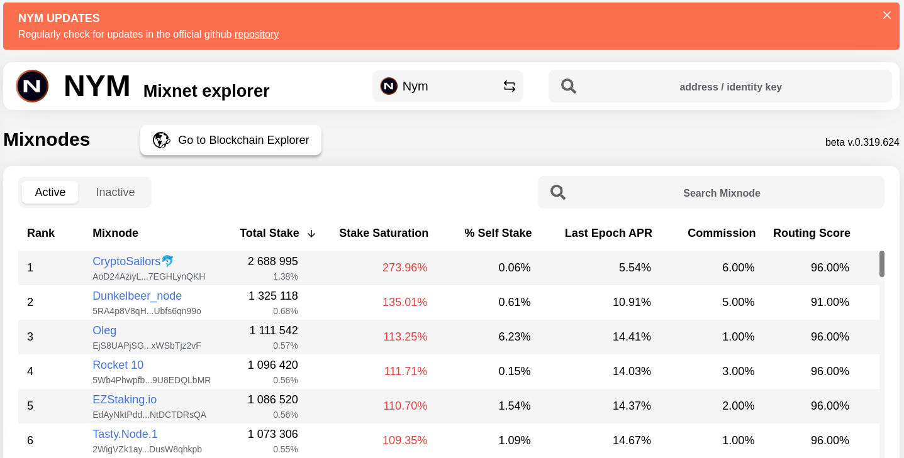
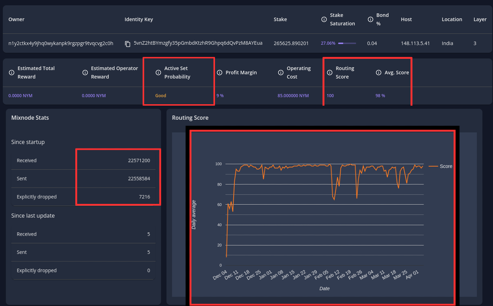

# 3. Delegación hacia los Nodos de la Mixnet

###

### 3.1 Delegación Nym tokens para staking por NYM Wallet

La delegación de tokens Nymx para staking en mixnodes es un elemento fundamental dentro del ecosistema de Nym, capacitando a los usuarios para participar activamente en la Mixnet y asegurar su seguridad y eficacia. Al delegar sus tokens a mixnodes, los usuarios juegan un papel esencial en el proceso de mezcla de datos, fortaleciendo la infraestructura de la red y garantizando la confidencialidad de las comunicaciones en línea. Este proceso refleja el firme compromiso de la comunidad con la preservación de la privacidad en línea.

1. Vamos a "Delegation" y damos clic.

<figure><figcaption></figcaption></figure>

2. Vamos al explore[ Explore de Nym para Mixnodes](https://explorer.nymtech.net/network-components/mixnodes) o [Explore Guru Nym para Mixnodes.](https://mixnet.explorers.guru/mixnodes)

<figure><figcaption>
<a href="https://explorer.nymtech.net/network-components/mixnodes">https://explorer.nymtech.net/network-components/mixnodes</a>
</figcaption></figure>

<figure><figcaption>
<a href="https://mixnet.explorers.guru/mixnodes">https://mixnet.explorers.guru/mixnodes</a>
</figcaption></figure>

3. Busca por [Explore de Nym para Mixnodes](https://explorer.nymtech.net/network-components/mixnodes) según el país que quieres,  y luego revisar en el  [Explore Guru Nym para Mixnodes](https://mixnet.explorers.guru/mixnodes) para poder revisar un poco más de detalle sobre el nodo que vas a escoger., Haz una comparativa y escoge el que te convenga de acuerdo a su descripción. Recuerda copiar el "Identity Key".

<figure><figcaption></figcaption></figure>

Revisión antes elegir el staking:&#x20;

* **1: Comprobar la saturación del mixnode:** Evita delegar en nodos completamente saturados ya han alcanzado el 100% de saturación. , ya que no generarán más recompensas y podrían afectar negativamente a la cuota de recompensas de los delegadores.

<figure><figcaption></figcaption></figure>

* **2: Comprobación del rendimiento del mixnode:** Busca nodos con un buen tiempo de actividad. Por ejemplo, si un nodo tiene un tiempo de actividad del 98%, significa que está en funcionamiento el 98% del tiempo. Además, asegúrate de que el nodo no tenga problemas de caída de paquetes.

<figure><figcaption></figcaption></figure>

* **3: Comprobar el margen de beneficio del mixnode:** Busca mixnodes con un margen de beneficio equitativo, ya que aquellos con un alto margen se llevan la mayor parte de las recompensas.

<figure><figcaption></figcaption></figure>

La rentabilidad para los delegados (APY) puede variar, pero las simulaciones sugieren que podría ser del 45% inicialmente, disminuyendo a un promedio del 7-8% a medida que crece la oferta y la red. Es importante tener en cuenta que esta información se basa en escenarios hipotéticos y que los resultados reales pueden variar significativamente.&#x20;

Si quiere más información extensa visita: [¿Quieres hacer staking en Nym? Aquí se explica cómo elegir un nodo mixto para delegar NYM a…](https://medium.com/@nymspanish/quieres-hacer-staking-en-nym-aqu%C3%AD-se-explica-c%C3%B3mo-elegir-un-nodo-mixto-para-delegar-nym-a-b1524eb0b611)

4. Copias el "Identity Key".

<figure><figcaption></figcaption></figure>

5. Clic en " Delegate".

<figure><figcaption></figcaption></figure>

6. Se abrirá para delegar al mxinode que elegimos, lo cual primero introducimo el  "Identity Key" y luego la cantidad en "Amount". Clic en "Delegate stake".

<figure><figcaption></figcaption></figure>

7. En "Confirm".

<figure><figcaption></figcaption></figure>

Al final ya esta delegado al Mixnode para el staking y solo esperamos el siguiente Epoch para que se complete la delegación.

<figure><figcaption></figcaption></figure>

### 3.2  Delegación Nym tokens para staking por Keplr Wallet

1. Para conseguir Nym para la delegación clic en:[ Leer la guía de adquisición por Keplr wallet](1.-adquisicon-con-bridge-y-swap/1.2-keplr.md).  Si lo tiene NYM wallet mira el tutorial de envió a la wallet.

**Tutorial**&#x20;

a) Hacia la wallet de Keplr ([buscar IBC Nyx](https://chains.keplr.app/)) and dar a "Add to Keplr"

<figure><figcaption></figcaption></figure>

b) Ir a "Approve" para aprobar la conexión a tu wallet.

<figure><figcaption></figcaption></figure>

c) Buscar nyx y donde vas a "manage", te va abrir una ventada donde debes indicar Nyx y dar en el botón "Save" para guardar los cambios.

<figure><figcaption></figcaption></figure>

d) Revisa tu wallet esta habilitada la IBC Nyx

<figure><figcaption></figcaption></figure>

e) Clic en  "Deposit"

<figure><figcaption></figcaption></figure>

f)  Clic en copiar la dirección de Nym.

<figure><figcaption></figcaption></figure>

g) Luego de copiar la dirección, haz el envió de los NYM (Leete la guía de ["Envío de NYM"](2.-envio-y-recepcion-en-blockchain-nyx.md#id-2.1-envio-de-nym) si no sabes enviar desde la  NYM wallet)

2. Ir la pagina [https://explorer.nymtech.net/](https://explorer.nymtech.net/) y dar clic en el icono como se muestra en la imagen.

<figure><figcaption></figcaption></figure>

3. Ir a "Mixnodes"

<figure><figcaption></figcaption></figure>

4. Escribir el Identity Key del nodo que quiere delegar (staking), si tienes alguna incertidumbre sobre qué nodo elegir, a bajo te  proporcionare los parámetros clave que debes revisar antes de tomar una decisión,

<figure><figcaption></figcaption></figure>

Revisión antes elegir el staking:&#x20;

* **1: Comprobar la saturación del mixnode:** Evita delegar en nodos completamente saturados ya han alcanzado el 100% de saturación. , ya que no generarán más recompensas y podrían afectar negativamente a la cuota de recompensas de los delegadores.

<figure><figcaption></figcaption></figure>

* **2: Comprobación del rendimiento del mixnode:** Busca nodos con un buen tiempo de actividad. Por ejemplo, si un nodo tiene un tiempo de actividad del 98%, significa que está en funcionamiento el 98% del tiempo. Además, asegúrate de que el nodo no tenga problemas de caída de paquetes.

<figure><figcaption></figcaption></figure>

* **3: Comprobar el margen de beneficio del mixnode:** Busca mixnodes con un margen de beneficio equitativo, ya que aquellos con un alto margen se llevan la mayor parte de las recompensas.

<figure><figcaption></figcaption></figure>

La rentabilidad para los delegados (APY) puede variar, pero las simulaciones sugieren que podría ser del 45% inicialmente, disminuyendo a un promedio del 7-8% a medida que crece la oferta y la red. Es importante tener en cuenta que esta información se basa en escenarios hipotéticos y que los resultados reales pueden variar significativamente.&#x20;

Si quiere más información extensa visita: [¿Quieres hacer staking en Nym? Aquí se explica cómo elegir un nodo mixto para delegar NYM a…](https://medium.com/@nymspanish/quieres-hacer-staking-en-nym-aqu%C3%AD-se-explica-c%C3%B3mo-elegir-un-nodo-mixto-para-delegar-nym-a-b1524eb0b611)

5. Clic para conectar.

<figure><figcaption></figcaption></figure>

6. Clic en el icono de keplr Wallet para conectar.

<figure><figcaption></figcaption></figure>

7. Clic en " Delegate" para delegar.

<figure><figcaption></figcaption></figure>

8. Ver el identity key el que vas a delegar, la cantidad que vas hacer staking y luego clic en "Delegete" para delegar al nodo.

<figure><figcaption></figcaption></figure>

9. Clic en "Aprrove" para confirmar la delegación

<figure><figcaption></figcaption></figure>

10. &#x20;Delegado el nodo para el staking.

<figure><figcaption></figcaption></figure>

